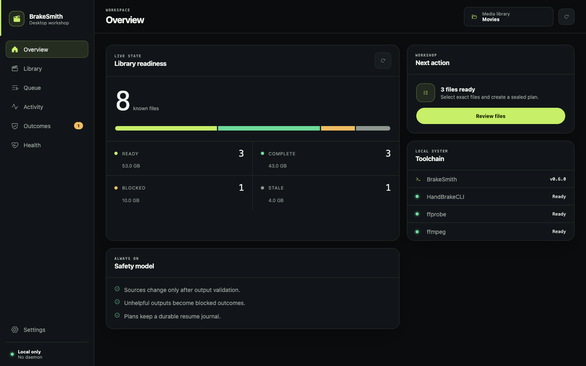

<div align="center">
<br />

<h1>BrakeSmith</h1>
<p><strong>Review, transcode, and maintain an HEVC media library.</strong></p>
<p>
<a href="https://github.com/me-cedric/BrakeSmith/actions/workflows/ci.yml"></a>
<a href="https://github.com/me-cedric/BrakeSmith/releases/latest"></a>
<a href="LICENSE"></a>
<a href="https://www.python.org"></a>
</p>
<br />
</div>

<p align="center">
  
</p>

BrakeSmith converts selected videos to 10-bit H.265 in MKV with HandBrakeCLI. It scans first, shows exact candidates, and validates each output before publication. The CLI and desktop app use the same processing engine.

BrakeSmith also remembers results. A failed or non-beneficial file does not return in each new candidate list while the file stays unchanged.

## Status

| Area | Current state |
| --- | --- |
| Current release | [BrakeSmith 0.6.0](https://github.com/me-cedric/BrakeSmith/releases/tag/v0.6.0) |
| Desktop | macOS ARM64, Windows x64, and Linux x86_64 packages |
| CLI | Python package and standalone executables for macOS, Windows, and Linux |
| Privacy | Local processing only. No account, daemon, telemetry, or upload service. |
| Signing | Public desktop and standalone packages are unsigned. |

BrakeSmith is pre-1.0 software. Review the selected files and destination paths before a large replacement batch.

## Core features

### Review and transcode

- Scan local or mounted network libraries recursively.
- Review codec, resolution, size, duration, audio, subtitles, HDR, and warnings.
- Select exact files or export the complete candidate list.
- Use resolution-aware H.265/x265 Main 10 presets for 480p through 4K.
- Keep selected audio and subtitle languages by full name or ISO code.

### Safe execution

- Create sealed plans with source identity and destination checks.
- Resume an interrupted plan from its durable journal.
- Validate codec, duration, tracks, chapters, and readability before publication.
- Keep source files by default.
- Replace a source only after a smaller output passes validation.
- Stop a replacement encode when its partial output reaches the source size.

### Library memory

- Classify files as ready, complete, blocked, or stale.
- Remember successful, failed, cancelled, and non-beneficial attempts.
- Exclude unchanged blocked files from later candidate lists.
- Retry or forget selected outcomes when you want another attempt.
- Remove records for moved or deleted files with one prune command.

### Desktop and automation

- Use the same workflow from the Tauri desktop app or CLI.
- Run quick header checks or full frame-decoding health checks.
- Use JSON output, named TOML profiles, and non-interactive options.
- Process mounted SMB and other network shares without cross-filesystem moves.

## Install

### Desktop app

Download the latest installer from [GitHub Releases](https://github.com/me-cedric/BrakeSmith/releases/latest):

- macOS ARM64: DMG
- Windows x64: MSI or setup executable
- Linux x86_64: AppImage, DEB, or RPM

Desktop packages include the BrakeSmith CLI sidecar. They do not include HandBrakeCLI or FFmpeg tools.

### CLI

Install with [uv](https://docs.astral.sh/uv/):

```sh
uv tool install git+https://github.com/me-cedric/BrakeSmith.git
```

Or install with pipx:

```sh
pipx install git+https://github.com/me-cedric/BrakeSmith.git
```

Standalone CLI executables are also available in [GitHub Releases](https://github.com/me-cedric/BrakeSmith/releases/latest).

## System tools

BrakeSmith requires:

- [HandBrakeCLI](https://handbrake.fr/downloads2.php) for transcoding.
- `ffprobe` from [FFmpeg](https://ffmpeg.org/download.html) for inspection and validation.
- `ffmpeg` for optional full health checks.

macOS:

```sh
brew install handbrake ffmpeg
```

Windows:

```powershell
winget install HandBrake.HandBrake.CLI
winget install Gyan.FFmpeg
```

Ubuntu or Debian:

```sh
sudo apt install handbrake-cli ffmpeg
```

Check the local toolchain:

```sh
brakesmith doctor
```

The HandBrake desktop app does not always install `HandBrakeCLI`. Install the CLI package if BrakeSmith cannot find it.

## Quick start

Scan the current directory. This command does not change media:

```sh
brakesmith scan
```

Review candidates and start an interactive batch:

```sh
brakesmith run
```

For a Tdarr-style replacement batch of five files:

```sh
brakesmith run /path/to/library --replace-source --max-files 5
```

BrakeSmith deletes a source only after a smaller output passes validation. It deletes an equal or larger output and records a blocked `not-smaller` outcome.

For unattended processing:

```sh
brakesmith run /path/to/library \
  --replace-source \
  --max-files 5 \
  --format-preset recommended \
  --non-interactive \
  --unknown-audio keep \
  --unknown-subtitles drop \
  --yes
```

In the desktop app:

1. Choose a media library.
2. Review the Library page and select exact files.
3. Build a queue and review its sealed plan.
4. Start the plan and monitor Activity.
5. Use Outcomes to retry, forget, or prune records.

## Outcome registry

BrakeSmith stores global state outside media directories. It uses `$XDG_STATE_HOME/brakesmith` or `~/.local/state/brakesmith` on macOS and Linux. Windows uses `%LOCALAPPDATA%\brakesmith`.

| State | Meaning |
| --- | --- |
| Ready | The file is a candidate for the current policy. |
| Complete | The file is already suitable or has a matching successful result. |
| Blocked | An unchanged attempt failed or produced no useful size reduction. |
| Stale | The recorded source moved, changed, or no longer exists. |

Inspect state and recent attempts:

```sh
brakesmith status /path/to/library
brakesmith history /path/to/library
brakesmith failures list
```

Allow another attempt:

```sh
brakesmith retry "/path/to/library/movie.mkv"
brakesmith retry --type not-smaller
```

Clean or remove records:

```sh
brakesmith failures forget "/path/to/library/movie.mkv"
brakesmith failures prune
brakesmith failures clear --logs-only
```

`prune` removes stale records and orphan diagnostic logs. It does not delete media. A source or policy change also makes the file eligible for evaluation again.

## Main commands

| Command | Purpose |
| --- | --- |
| `brakesmith doctor` | Check required tools. |
| `brakesmith scan [DIRECTORY]` | Inspect supported media. |
| `brakesmith candidates [DIRECTORY]` | Show or export eligible files. |
| `brakesmith run [DIRECTORY]` | Review and process a batch. |
| `brakesmith plan [DIRECTORY]` | Create a sealed plan without encoding. |
| `brakesmith execute PLAN` | Execute or resume a plan. |
| `brakesmith status [DIRECTORY]` | Show ready, complete, blocked, and stale files. |
| `brakesmith history [DIRECTORY]` | Show recent outcomes. |
| `brakesmith retry FILE...` | Release blocked files for another attempt. |
| `brakesmith health [DIRECTORY]` | Check media without changing it. |
| `brakesmith failures` | Inspect and maintain global outcome records. |

Use `brakesmith --help` or `brakesmith COMMAND --help` for all options.

## Output and safety

Default mode keeps the source. For example, `movie.mp4` becomes `movie.brakesmith.mkv`.

Replacement mode normalizes common codec text. For example, `Movie.1080p.x264.mp4` becomes `Movie.1080p.x265.mkv`.

Safety rules:

- BrakeSmith writes incomplete output to a `.mkv.part` file.
- Cancellation and encode failure remove only the incomplete output.
- Existing destinations are never overwritten without validation and an explicit policy.
- BrakeSmith checks source identity before and after each encode.
- A failed source deletion keeps both valid files and records the failure.
- `--stop-when-larger` can stop unhelpful replacement work early.

MKV supports more audio and subtitle formats than MP4. This reduces conversion and information loss.

## Development

CLI:

```sh
git clone https://github.com/me-cedric/BrakeSmith.git
cd BrakeSmith
uv sync --extra dev
uv run pytest
uv run ruff check .
uv build
```

Desktop:

```sh
cd desktop
npm install
npm run sidecar
npm test
npm run tauri dev
```

CI tests Python 3.9 and 3.13 on macOS, Windows, and Linux. It also builds packages and standalone executables. A separate workflow tests and packages the desktop app for all three systems.

## Documentation

- [Desktop development and packaging](desktop/README.md)
- [Desktop interface specification](desktop/UI_SPEC.md)
- [Contributing](CONTRIBUTING.md)
- [Security policy](SECURITY.md)
- [Migration notes](MIGRATION.md)

## License

[MIT](LICENSE)
